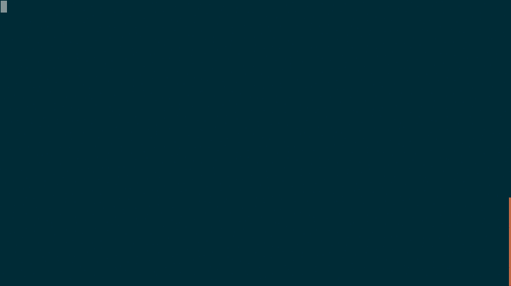

# vim 配色方案


目前支持以下几种，可以在 `~/.MyVim/vimrcs/basic.vim` 和 `~/.MyVim/vimrcs/extended.vim` 文件里面修改。

```
colorscheme badwolf
colorscheme peaksea
colorscheme solarized
colorscheme ir_black
colorscheme mayansmoke
colorscheme pyte
```

你如果需要用其他的配色方案，可以到 Github 上面自行下载，
然后参考 `~/.MyVim/sources_forked/badwolf` 目录来放置就可以了。

在 ubuntu 16.04 下使用 `solarized` 这个配色方案需要安装 [gnome-terminal-colors-solarized](https://github.com/Anthony25/gnome-terminal-colors-solarized) 这个修改终端颜色的工具。

建议使用 `solarized` 这个配色方案。

```
set background=dark
colorscheme solarized
```

在 `.bashrc` 文件中添加 `export TERM=xterm-256color`

<details>
<summary>展开查看图片</summary>

</details>

## 状态栏和标题栏颜色配置

见 `~/.MyVim/vimrcs/plugins_config.vim` 里面的 `lightline`, 详细配置参考
[lightline.vim](https://github.com/itchyny/lightline.vim)。

* * *

> 按 `gg` 回到文档顶部。
>
> 将光标移动到下面的文件名上，执行 `gf` 跳转。
>
> [目录](README.md)
>
> <a href='https://github.com/MDGSF/MyVim'><small>↑Back to Home↑</small></a>

