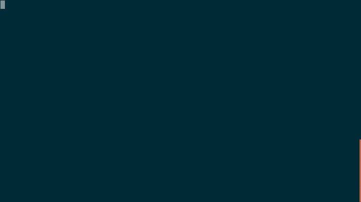

# vim 配色方案


目前支持以下幾種，可以在 `~/.MyVim/vimrcs/basic.vim` 和 `~/.MyVim/vimrcs/extended.vim` 文件裡麵修改。

```
colorscheme badwolf
colorscheme peaksea
colorscheme solarized
colorscheme ir_black
colorscheme mayansmoke
colorscheme pyte
```

你如果需要用其他的配色方案，可以到 Github 上麵自行下載，
然後參考 `~/.MyVim/sources_forked/badwolf` 目錄來放置就可以了。

在 ubuntu 下使用 `solarized` 這個配色方案需要安裝 [gnome-terminal-colors-solarized](https://github.com/Anthony25/gnome-terminal-colors-solarized) 這個修改終端顏色的工具。

建議使用 `solarized` 這個配色方案。

```
set background=dark
colorscheme solarized
```

在 `.bashrc` 文件中添加 `export TERM=xterm-256color`

<details>
<summary>展開查看圖片</summary>

</details>

## 狀態欄和標題欄顏色配置

見 `~/.MyVim/vimrcs/plugins_config.vim` 裡麵的 `lightline`, 詳細配置參考
[lightline.vim](https://github.com/itchyny/lightline.vim)。

* * *

> 按 `gg` 回到文檔頂部。
>
> 將光標移動到下麵的文件名上，執行 `gf` 跳轉。
>
> [目錄](README.md)
>
> <a href='https://github.com/MDGSF/MyVim'><small>↑Back to Home↑</small></a>

