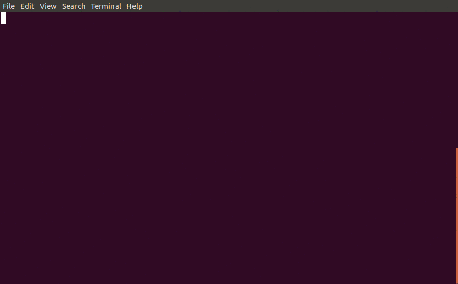

# Vim 折叠代码

```vim
ac 折叠代码
zo 展开代码
za 如果代码处于未折叠状态，就折叠代码。
   如果代码处于折叠状态，就展开代码。
```

## Vim 折叠代码有几种模式

```vim
set foldmethod=manual
set foldmethod=indent
set foldmethod=expr
set foldmethod=marker
set foldmethod=syntax
set foldmethod=diff
```

### manual

`set foldmethod=manual` 进入手动折叠模式

**方法一：**
进入 visual 模式，选中文本，按 `zf` 折叠代码。

<details>
<summary>展开查看图片</summary>

</details>

### indent

`set foldmethod=indent` 进入缩进折叠模式。

### expr

### marker

### syntax

### diff

* * *

> 按 `gg` 回到文档顶部。
>
> 将光标移动到下面的文件名上，执行 `gf` 跳转。
>
> [目录](README.md)
>
> <a href='https://github.com/MDGSF/MyVim'><small>↑Back to Home↑</small></a>

